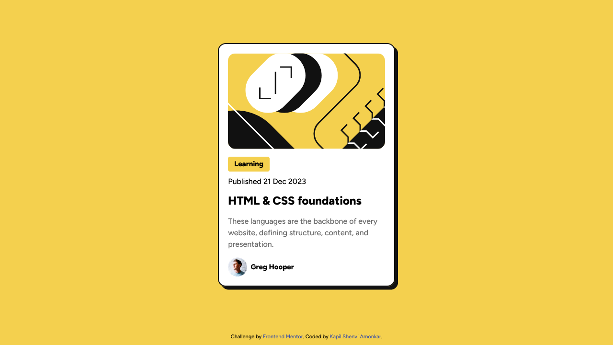
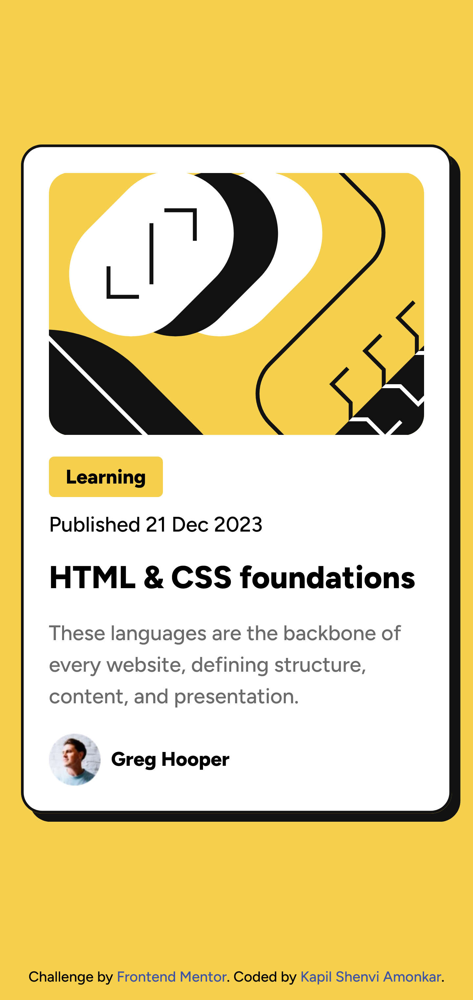
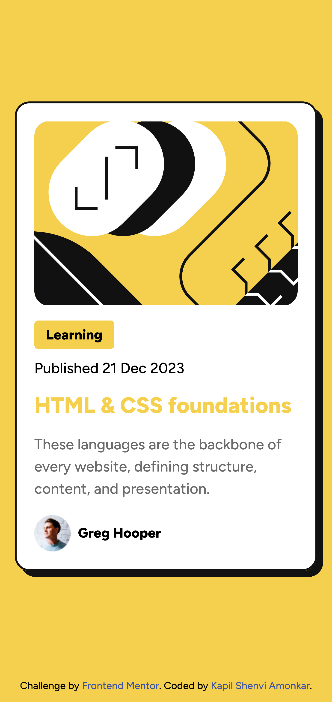

# Frontend Mentor - Blog preview card solution

This is a solution to the [Blog preview card challenge on Frontend Mentor](https://www.frontendmentor.io/challenges/blog-preview-card-ckPaj01IcS). Frontend Mentor challenges help you improve your coding skills by building realistic projects. 

## Table of contents

- [Overview](#overview)
  - [Screenshot](#screenshot)
  - [Links](#links)
- [My process](#my-process)
  - [Built with](#built-with)
  - [What I learned](#what-i-learned)
  - [My workflow/planning](#my-workflow-and-planning)
  - [Useful resources](#useful-resources)
- [Author](#author)

## Overview

### Screenshot

  
  

 

### Links

- Solution URL: [QR Code Challenge Solution](https://github.com/kapil-2695/fmc-blog-preview-card)
- Live Site URL: [Live site - QR Code component](https://kapil-2695.github.io/fmc-blog-preview-card)

## My process
  
### Built with

- Semantic HTML5 markup
- CSS custom properties
- CSS Grid
- Mobile-first workflow

### What I learned

I learned the importance maintaining the order of elements in HTML for accessibility purposes and use CSS to re-order them as per the design. Using flex and grid lets us reorder items in CSS using `order: number` property.

### My workflow and planning

- I designed HTML template first by planning the wrpappers, containers based on layout.
- I used __ to give children class names so that I don't have to struggle with specificity.
- The CSS code flow:
  - Downloaded the fonts and imported using @font-face.
  - Defined custom properties such as `color (--clr-shade-num)`, `font-size (--fs-num)`, `font-weight (--fw-num)` and `border-radius (--br-num)` in `:root`.
  - Reset some CSS styles from the pre-existing default styles.
  - Set the typography (`font-size`, `font-weight`, `color`, `@font-face` etc.)
  - ... and after all above, started shaping the layout.

### Useful resources

- [Learn CSS - web.dev](https://web.dev/learn/css/) - This helped me with CSS code.

## Author

- Frontend Mentor - [@kapil-2695](https://www.frontendmentor.io/profile/kapil-2695)
